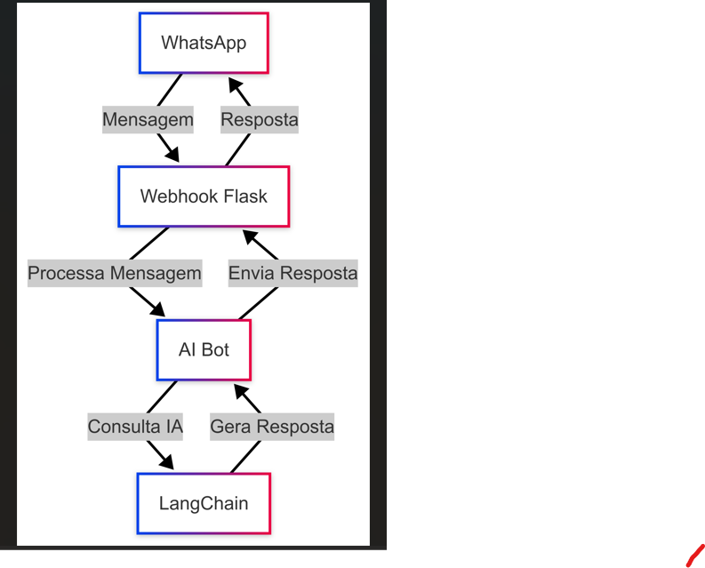
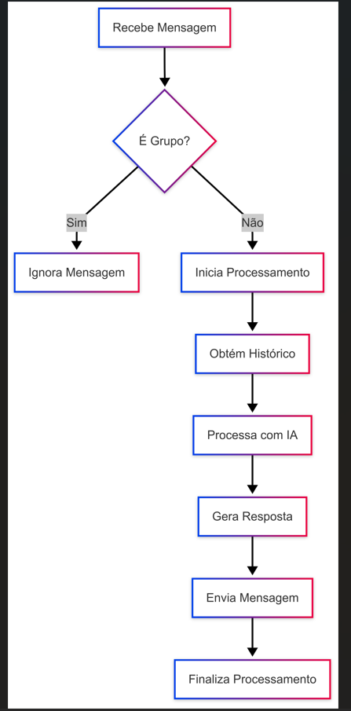

# WhatsApp AI Chatbot

Este é um chatbot de WhatsApp que utiliza inteligência artificial para responder mensagens de forma inteligente e contextual.

## Diagrama de Arquitetura



## Diagrama de Funcionalidades


## Requisitos

- Python 3.8+
- Docker (opcional)
- Conta no WhatsApp
- Acesso à API de IA (Groq)

## Instalação

1. Clone o repositório:
```bash
git clone https://github.com/seu-usuario/whatsapp_ai_chatbot.git
cd whatsapp_ai_chatbot
```

2. Crie e ative um ambiente virtual:
```bash
python -m venv venv
source venv/bin/activate  # Linux/Mac
# ou
.\venv\Scripts\activate  # Windows
```

3. Instale as dependências:
```bash
pip install -r requirements.txt
```

4. Configure as variáveis de ambiente:
Crie um arquivo `.env` na raiz do projeto com as seguintes variáveis:
```
GROQ_API_KEY=sua_chave_api
```

## Executando o Projeto

### Usando Python diretamente:

```bash
python app.py
```

### Usando Docker:

```bash
docker-compose up --build
```

## Estrutura do Projeto

- `app.py`: Aplicação principal Flask
- `bot/`: Implementação do chatbot AI
- `services/`: Serviços de integração com WhatsApp
- `rag/`: Implementação de RAG (Retrieval Augmented Generation)

## Funcionalidades

- Integração com WhatsApp via webhook
- Processamento de mensagens usando IA
- Suporte a histórico de conversas
- Respostas contextuais
- Ignorar mensagens de grupos
- Indicador de digitação

## Contribuindo

1. Faça um fork do projeto
2. Crie uma branch para sua feature (`git checkout -b feature/nova-feature`)
3. Commit suas mudanças (`git commit -m 'Adiciona nova feature'`)
4. Push para a branch (`git push origin feature/nova-feature`)
5. Abra um Pull Request

## Licença

Este projeto está sob a licença MIT. Veja o arquivo LICENSE para mais detalhes.
